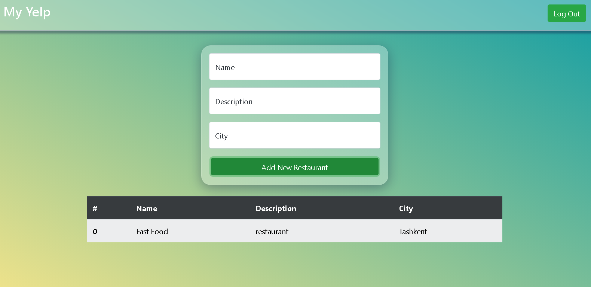

# Welcome to My Yelp
My Yelp App

## Task

[Live Demo](https://my-yelp-tapp.netlify.app)

## Result



## Installation

```
npm i or npm install
```

## Usage
TechStack

- HTML, CSS
- Bootstrap5
- @fortawesome/fontawesome
- firebase
- react-spinners
- react-uuid
- React

Features

- add new restaurant
- restaurant name, description, city

Update

- many bugs have been fixed.

### The Core Team

- <a href="https://github.com/Oqilbek2121">To'lqinov Oqilbek</a><br>

### My Dropbox demo link 

```
    https://my-yelp-tapp.netlify.app
```